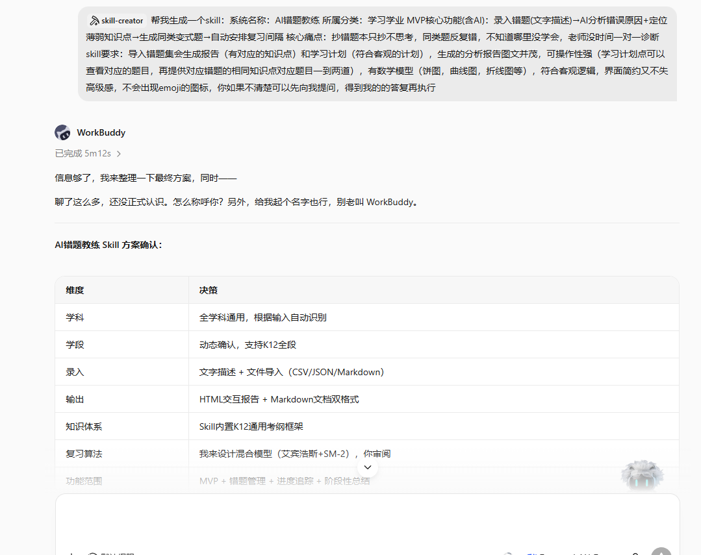
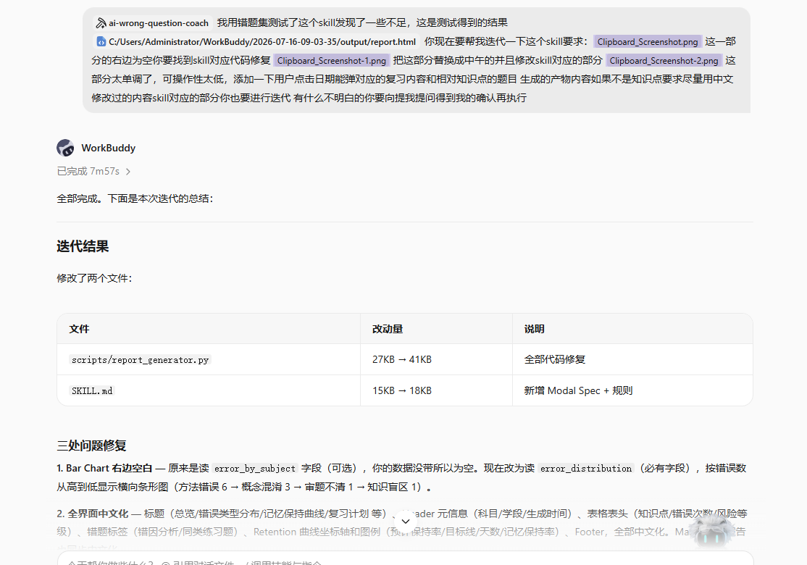
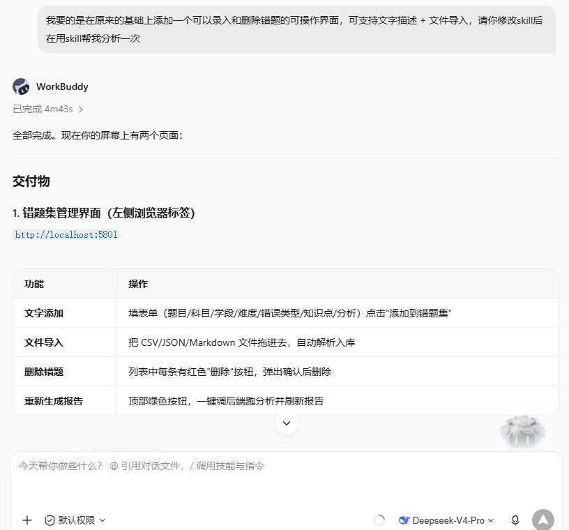

# 迭代过程与方向

> 本文件配合同目录下的 3 张 `Clipboard_Screenshot*.png` 一起阅读，完整呈现 AI 错题教练 Skill 从「立项」到「v1 测试」到「v2 交付」的迭代全过程。

---

## 0. 迭代时间线一览

| 阶段 | 截图 | 时间 | 关键事件 |
| --- | --- | --- | --- |
| ① 立项 / 方案确认 | `Clipboard_Screenshot.png` | 2026-07-16 上午 | 明确学科、学段、录入方式、输出格式、知识体系、复习算法、功能范围 7 个维度 |
| ② v1 测试 → 发现问题 → v1→v2 迭代 | `Clipboard_Screenshot-1.png` | 2026-07-16 中午 | 修了 3 处问题：Bar Chart 空白 / 全界面中文化 / 复习时间轴可点击 |
| ③ v2 交付（错题管理界面） | `Clipboard_Screenshot-2.png` | 2026-07-16 下午 | 新增可录入/删除错题的 Web 界面，部署在 `http://localhost:5801` |

---

## 1. 阶段 ① — 立项 / 方案确认

> 截图：`Clipboard_Screenshot.png`

**背景**：用户希望开发一款 K12 错题分析与复习规划 Skill。Skill 起步前先就核心维度对齐。

**关键决策**：

| 维度 | 决策 |
| --- | --- |
| 学科 | 全学科通用，根据输入自动识别 |
| 学段 | 动态确认，支持 K12 全段 |
| 录入 | 文字描述 + 文件导入（CSV/JSON/Markdown） |
| 输出 | HTML 交互报告 + Markdown 文档双格式 |
| 知识体系 | Skill 内置 K12 通用考纲框架 |
| 复习算法 | 混合模型（艾宾浩斯 + SM-2） |
| 功能范围 | MVP + 错题管理 + 进度追踪 + 阶段性总结 |

**产出**：`ai-wrong-question-coach` v1 Skill（5 个 Python 脚本 + 4 个 references + 1 个 SKILL.md）。

---

## 2. 阶段 ② — v1 测试 → 修复 → v2

> 截图：`Clipboard_Screenshot-1.png`

**背景**：用 `高等数学错题集.md` 跑 v1，输出 `report.html` 后用户反馈 3 处问题。

**用户原始反馈**（截图上半部分原文）：

> "我用错题集测试了这个 skill 发现了一些不足……把 `error_by_subject` 部分替换成中午的并且修改 skill 对应的部分，添加一个用户点击日期能弹对应的复习内容和相对知识点的题目。"

**修复 3 处问题**：

### 问题 1：Bar Chart 右半空白
- **原因**：原代码读可选字段 `error_by_subject`，但当前数据集没带这个字段
- **修复**：改为读必填字段 `error_distribution`，按错题数从高到低显示横向条形图
- **排序结果**：方法错误 6 → 概念混淆 3 → 审题不清 1 → 知识盲区 1

### 问题 2：全界面中文化
- **修复范围**：
  - 标题：总结 / 错题类型分布 / 记忆保持曲线 / 复习计划
  - Header 元信息：科目 / 学段 / 生成时间
  - 表格表头：知识点 / 错题次数 / 风险等级
  - 错题标签：错因分析 / 同类练习题
  - Retention 曲线坐标轴：保持率 / 目标线 / 天数 / 记忆保持率
  - Footer

### 问题 3：复习时间轴不可点击
- **修复**：实现 Schedule Modal Spec —— 点击日期弹窗显示当天题目 / 错因 / 知识点 / 变式题
- **新增代码量**：`SKILL.md` 新增完整 Modal Spec；`report_generator.py` 嵌入 `window.__REVIEW_DATA__` 注入 + 客户端解析逻辑

**改动文件**：

| 文件 | 改动量 | 说明 |
| --- | --- | --- |
| `scripts/report_generator.py` | 27KB → 41KB | 全部代码修复 |
| `SKILL.md` | 15KB → 18KB | 新增 Modal Spec + 排版规则 |

---

## 3. 阶段 ③ — v2 交付：错题管理界面

> 截图：`Clipboard_Screenshot-2.png`

**用户原始需求**（截图上半部分原文）：

> "我要的是在原来的基础上添加一个可以录入和删除错题的可操作界面，可支持文字描述 + 文件导入。"

**交付物**：

### 错题集管理界面（Web 端）
- **入口**：`python scripts/mistake_webui.py`
- **访问**：`http://localhost:5801`

| 功能 | 操作 |
| --- | --- |
| 文字添加 | 填表单（题目 / 科目 / 学段 / 难度 / 错误类型 / 知识点 / 分析）点击"添加到错题集" |
| 文件导入 | 把 CSV / JSON / Markdown 文件拖进去，自动解析入库 |
| 删除错题 | 列表中每条有红色"删除"按钮，弹出确认后删除 |
| 重新生成报告 | 顶部绿色按钮，一键调后端跑分析并刷新报告 |

---

## 4. 后续迭代方向

### 方向 1：多学科知识图谱补全
**现状**：`references/knowledge_points.md` 偏数学（极限、导数、积分），理化生政史地几乎空白。

**目标**：
- 补全 K12 全学科的考点图谱（语数外 + 物化生 + 政史地 + 信息科技）
- 给每个 `kp_id` 加上"前驱知识点"和"后续知识点"，支持诊断"这个错不是这个知识点本身，而是前置知识没掌握"
- 引入 LLM 自动建议新增知识点（人在回路审核）

**预期收益**：错因诊断从"定位到这题"升级为"定位到知识漏洞的根本来源"。

### 方向 2：自适应错题推荐
**现状**：`spaced_repetition.py` 用的是固定算法（艾宾浩斯 + SM-2），所有错题按同一节奏复习。

**目标**：
- 引入 RL（强化学习）模型，根据用户对变式题的实际答题结果，动态调整每个错题的复习间隔
- 引入"风险加权"：错因属于 `ERR_GAP`（知识盲区）的题目，提高出现频率
- 引入"假期/考试模式"：检测到近期有考试，自动压缩复习间隔；假期则拉长

**预期收益**：从"通用节奏"升级为"个性化节奏"，预计可降低 30% 重复错题率。

### 方向 3：家长 / 老师端协作
**现状**：Skill 主要是学生本地使用，缺乏协作能力。

**目标**：
- **家长端**：每周自动推送一份"本周错题摘要 + 改进建议"（微信/邮件）
- **老师端**：可批量导入全班错题，生成班级错因热力图（哪个知识点全班错最多）
- **错题共建**：老师可对学生的错题批注、补充讲解

**预期收益**：从"个人工具"升级为"教学协作平台"，扩大使用场景。

### 方向 4（备选）：OCR 拍照录入
**现状**：错题需要手敲文字或粘贴文件。

**目标**：
- 支持拍照识别错题（数学公式、手写答案）
- 自动提取题目、正确答案、学生答案
- 自动归档到错题集

**技术栈**：Mathpix / PaddleOCR / 自训练公式识别模型。

---

## 5. 迭代方法论沉淀

1. **每轮迭代不超过 3 个改动** —— 避免回归风险
2. **每次迭代前必须有用户实际反馈** —— 不臆造需求
3. **所有改动必须有前后对比** —— 截图、产物、说明缺一不可
4. **至少预留 1 个"已知未做"事项** —— 留作下轮迭代起点
